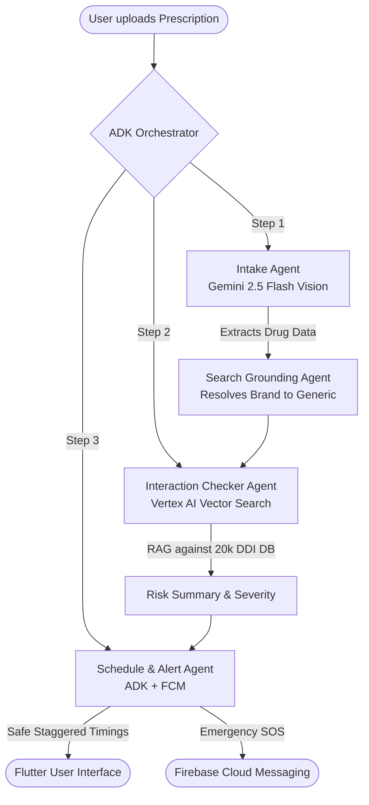

# 💊 Medication Orchestra — Household Geriatric Medication Safety Agent

**Track:** Concierge Agents | **Stack:** Flutter (Client) + FastAPI / Google ADK (Backend) + Vertex AI RAG

*"Photograph your prescriptions. The agent reads them, checks for dangerous interactions across your whole household, tells you the safe time gap between conflicting medicines, and alerts your family if something goes wrong."*

---

## 📖 Table of Contents
1. [Project Overview](#-project-overview)
2. [The Real-World DDI Problem](#-the-real-world-ddi-problem)
3. [Multi-Agent Architecture (Google ADK)](#-multi-agent-architecture-google-adk)
4. [Security & Injection Safeguards](#-security--injection-safeguards)
5. [Repository Structure](#-repository-structure)
6. [Local Development Setup](#-local-development-setup)
7. [Cloud Run Deployment Setup](#-cloud-run-deployment-setup)
8. [GCP Observability & Monitoring](#-gcp-observability--monitoring)

---

## 🎯 Project Overview

In many developing countries, particularly India, elderly patients manage multiple chronic conditions (co-morbidities) by visiting independent specialists. Because there is **no unified Electronic Health Record (EHR)** database and clinic visits are hurried (averaging under 5 minutes), doctors only see the drugs they prescribe. 

**Medication Orchestra** acts as a continuous, household-level guardian. A team of coordinated AI agents processes prescription scans, maps Indian brand names to generic chemicals, runs RAG checks for interactions, creates safe, staggered daily schedules, and handles SOS notifications.

---

## 🩺 The Real-World DDI Problem

This solution addresses critical health hazards backed by clinical statistics:
- **Adverse Drug Reactions (ADRs):** Estimated to be between the **4th and 6th leading cause of death worldwide** (*PubMed, 2023*).
- **Polypharmacy Risk:** Geriatric patients on 5+ concurrent medications face **more than double the rate of hospitalization** (*Scientific Reports, 2024*).
- **Geriatric DDI Prevalence:** Major drug interactions are present in **16.41% of elderly prescriptions** (*European Journal of CV Medicine, 2025*).
- **The Indian Context:** India's pharmacovigilance database records **under 1%** of actual adverse events due to fragmented local chemists and poor reporting infrastructure. Medication Orchestra closes this gap directly in the home.

---

## 🤖 Multi-Agent Architecture (Google ADK)

The application utilizes a coordinated group of specialized agents built on the **Google Agent Development Kit (ADK)**:



1. **Intake Agent (Gemini 2.5 Flash Vision):** Extracts drug names, strengths, and frequencies from prescription photos. It translates standard pharmaceutical abbreviations (e.g. *OD, BD, TDS, QID, AC, PC, HS*).
2. **Search Grounding Agent (Google Search Grounding):** Resolves local Indian brand names (e.g. *Combiflam, Dolo 650, Ecosprin*) to their active generic compounds.
3. **Interaction Checker Agent (Vertex AI Vector Search RAG):** Cross-references all medications in the household against a database of 20,000+ interactions, providing plain-language risk summaries and severity scales.
4. **Schedule & Alert Agent (ADK + FCM):** Creates a daily schedule, staggers conflicting drugs (e.g. Warfarin and Ibuprofen) with a minimum 6-hour gap, sends alerts, and broadcasts emergency SOS notifications to designated family members.

---

## 🔒 Security & Injection Safeguards

To protect sensitive health information, Medication Orchestra employs a robust **3-layer security system**:

1. **Input Sanitization (`sanitize_drug_input`):** All user-derived strings are normalized and checked. Non-alphanumeric symbols typically used in prompt injections (e.g. `<|`, `]]`, `{{`, `---`, `\n`) are stripped, and blocklisted words (e.g., `"ignore"`, `"override"`, `"jailbreak"`) are rejected immediately.
2. **Output Schema Validation (`validate_agent_output`):** Gemini JSON output is parsed against strict Pydantic models. Any deviation or presence of prompt-leak patterns rejects the run, reverting to safe local rules.
3. **Least-Privilege Cloud Run Footprint:**
   - Image runs in non-root mode (`USER appuser`).
   - Uses direct IAM Service Account bindings for authentication via Google **Application Default Credentials (ADC)**—no raw API keys are committed or stored.

---

## 📁 Repository Structure

```text
MedicationOrchestrationAgent/
│
├── backend/                       # Python FastAPI Backend
│   ├── main.py                    # API Entrypoint
│   ├── requirements.txt           # Python Dependencies
│   ├── Dockerfile                 # Cloud Run container definition
│   ├── agents/                    # Google ADK Agents
│   │   ├── intake_agent.py        # Gemini Vision Extraction
│   │   ├── interaction_agent.py   # RAG Drug Interactions
│   │   └── schedule_agent.py      # Scheduling & SOS
│   └── services/                  # Business Logic & Auth Services
│
├── medication_orchestra/          # Flutter Client App
│   ├── lib/                       # Dart Source Code
│   │   ├── main.dart              # App Entrypoint
│   │   ├── screens/               # UI Screens (Login, Dashboard, Camera)
│   │   ├── services/              # API Communication
│   │   └── widgets/               # Reusable UI Components
│   ├── pubspec.yaml               # Flutter Dependencies
│   └── android/                   # Android-specific build configurations
│
├── scripts/                       # Utility Scripts
├── deploy.ps1                     # PowerShell script for GCP Deployment
└── monitoring_setup.ps1           # PowerShell script for GCP Metrics/Logs
```

---

## 💻 Local Development Setup

### Backend (FastAPI + Python)
1. Navigate to the backend directory:
   ```bash
   cd backend
   ```
2. Create and activate a virtual environment:
   ```bash
   python -m venv .venv
   source .venv/bin/activate  # Or on Windows: .venv\Scripts\activate
   ```
3. Install dependencies:
   ```bash
   pip install -r requirements.txt
   ```
4. Configure environment variables (create a `.env` file):
   ```env
   DEV_MODE=true
   PROJECT_ID=your-gcp-project-id
   ```
5. Run the server locally:
   ```bash
   uvicorn main:app --host 0.0.0.0 --port 8080 --reload
   ```

### Client (Flutter App)
1. Navigate to the client folder:
   ```bash
   cd medication_orchestra
   ```
2. Fetch Flutter packages:
   ```bash
   flutter pub get
   ```
3. Run the app on an Android emulator or physical device pointing to your local backend:
   ```bash
   flutter run --dart-define=API_BASE_URL=http://localhost:8080
   ```

---

## ☁️ Cloud Run Deployment Setup

The backend has been containerized and configured for automated serverless deployments to Google Cloud Run (scale-to-zero) via PowerShell:

1. Log in and configure your GCP CLI context:
   ```powershell
   gcloud auth login
   gcloud config set project your-gcp-project-id
   ```
2. Run the deployment script at the project root:
   ```powershell
   .\deploy.ps1
   ```
   *This automated script sets up the service account, binds roles (`datastore.user`, `aiplatform.user`, `firebaseauth.admin`, `logging.logWriter`), builds the image in Artifact Registry via Cloud Build, and deploys it serverlessly to Cloud Run.*

---

## 📈 GCP Observability & Monitoring

You can easily set up active logging and metric collection on Google Cloud Platform to track the health and latency of the agent pipeline.

1. **Upload the Health Dashboard:**
   ```powershell
   .\monitoring_setup.ps1
   ```
   *This deploys a custom 4-chart health dashboard to your GCP console, mapping request rates, P95/P99 latencies, active scaling instances, and 5xx error spikes.*
2. **Accessing logs:** Filter live logs by visiting your Google Cloud Console and navigating to the Cloud Run service logs.
